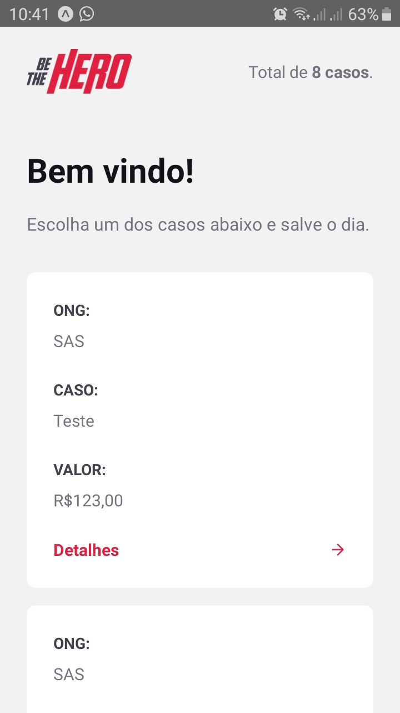

  

# Be The Hero - Mobile

## Overview

The main objective of this project is to provide a way to help Non-Governmental Organisation find "Heroes" to help in their causes. This can be done by providing a [web](https://github.com/igorsouza-dev/bethehero-frontend) interface for the NGO to insert their needs and then a "Hero" can find these needs using a [mobile app](https://github.com/igorsouza-dev/bethehero-mobile) and get in touch with the organization.
You will need the backend of this project and you can find it [here](https://github.com/igorsouza-dev/bethehero-backend).

  
  

## Setting up

### Requirements

- [Node.js](https://nodejs.org/en/download/)
- [Npm](https://www.npmjs.com/get-npm)
- [Yarn](https://yarnpkg.com/lang/en/docs/install/#debian-stable) - This is optional but in this readme I'll be using it on some CLI commands, you can use npm if you want.
- [Expo](http://expo.io) - Open-source platform for making universal native apps for Android, iOS, and the web with JavaScript and React.

### Dependencies

- [React.js](https://reactjs.org/) - JavaScript library for building user interfaces
- [Axios](https://github.com/axios/axios) - Promise based HTTP client
- [React Native](https://reactnative.dev/) - A framework for building native apps using React.
- [React Navigation](https://reactnavigation.org/) - Routing and navigation for React Native apps.
- [Styled Components](https://styled-components.com/) - Library that lets you write actual CSS inside JavaScript

### Dev Dependencies

- [Eslint](https://eslint.org) - Ecmascript linter
- [Prettier](https://prettier.io) - Code formatter

### Installing

All you need to do is run `yarn` at the root of the project in order to install the dependencies.

## Running

Run the command `yarn start` for a developer environment. This will execute expo. Open the Expo app in your emulator or your device and read the generated QR Code.
